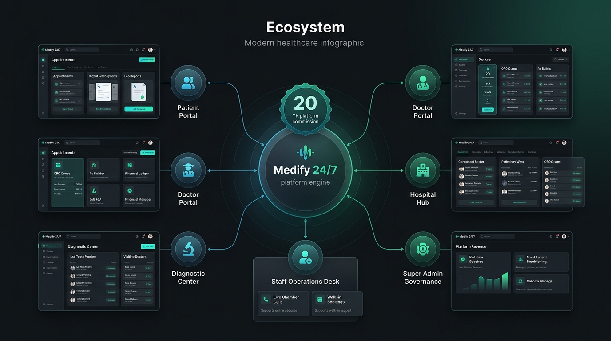

# Medify 24/7 - Features & Architecture Specification

**Medify 24/7** is an integrated digital healthcare ecosystem connecting patients, doctors, hospitals, diagnostic centers, staff members, and platform administrators.

---

## 🌟 1. Public Discovery & Patient Experience

### 🔍 Doctor Search & Profiles
- **Multi-Criteria Filtering**: Search by specialty, hospital/chamber location, consultation fees, and real-time availability.
- **Doctor Profiles**: View qualifications, bio, chamber affiliations, consultation fees, patient ratings, and available time slots.
- **Direct Serial Booking**: Instant booking flow from doctor cards and profile pages.

### 🏥 Institutions & Facilities Directory
- **Hospital Directory**: Browse accredited partner hospitals, departments, consultant rosters, and emergency services.
- **Diagnostic Centers**: Search diagnostic centers offering pathology, imaging, and specialized medical screenings.

### 🧪 Diagnostic Tests Catalog
- **Test Exploration**: Search lab tests by category (Pathology, Radiology, Biochemistry) with sample types and turnaround times.
- **Home Collection & Center Visits**: Choose between walking into a center or ordering home phlebotomy sample collection.

### 📅 Patient Portal (`/patient`)
- **Dashboard Overview**: Summary of upcoming appointments, active prescriptions, latest reports, and quick health metrics.
- **Appointments Management**: List, filter, view status (`Booked`, `Checked In`, `Waiting`, `In Consultation`, `Completed`), and access booking receipts.
- **Digital Prescriptions Hub**: View, download, and print digital prescriptions issued by doctors.
- **Diagnostic Reports Hub**: View and download finalized PDF laboratory test reports.
- **Profile & Health Data**: Manage medical profiles, emergency contacts, blood group, and allergies.

---

## 🧑‍⚕️ 2. Role-Based Portals & Workspaces

### 🩺 Doctor Portal (`/doctor`)
- **Doctor Workspace**: View daily queues, upcoming consultation schedules, and patient volume statistics.
- **Appointment Queue & Live Status Actions**: Move patients across statuses (`Checked In` ➔ `Waiting` ➔ `In Consultation` ➔ `Completed`).
- **Digital Prescription Builder (`/doctor/prescriptions/new`)**:
  - Interactive medication form (dosage, frequency, duration, instructions).
  - Diagnosis notes, clinical findings, and test recommendations.
  - Exportable and printable digital prescriptions.
- **Financial Report & Medify Profit**:
  - Gross consultation fee ledger, settled collections vs pending dues.
  - Multi-filtering by Date (Today, 7 days, 30 days, Custom Range), Chamber location, Payment status, and Search.
  - **Medify ৳20 TK Platform Fee** ledger and net practitioner payout.
  - One-click CSV financial statement export.

### 🏥 Hospital Portal (`/hospital`)
- **OPD Queue & Appointments**: Real-time management of doctor OPD consultations, serial calls, and patient arrivals.
- **In-House Diagnostic Tests Pipeline (Like OPD Queue)**:
  - Live test orders queue with stage advancement (`Booked` ➔ `Sample Collected` ➔ `In Analysis` ➔ `Report Ready`).
  - Sign & upload digital PDF lab reports directly.
  - In-house test catalog configuration (pricing, sample requirements, turnaround time).
- **Manual Booking & Lab Order Registration**:
  - `+ Manual OPD Booking`: Direct front-desk patient serial registration.
  - `+ Manual Lab Order`: Manual entry for walk-in pathology tests and home collection requests.
- **Consultant Doctor & Staff Roster CRUD**: Add, edit, and assign doctors and staff members to specific chambers.
- **Financial Statement & Medify Profit**:
  - Complete hospital OPD & diagnostic earnings ledger.
  - Automated **৳20 TK Medify platform commission deduction** per settled booking.
  - Multi-filtering by doctor, department, date range, and payment status with CSV export.

### 🔬 Diagnostic Center Portal (`/diagnostic`)
- **Orders & Sample Pipeline**:
  - Real-time sample tracking and processing pipeline (`Booked` ➔ `Sample Collected` ➔ `In Processing` ➔ `Report Ready`).
  - Modal to sign, verify, and publish digital PDF reports to patients.
- **Visiting Doctors & Live Serials Queue**:
  - Live doctor serials queue for visiting specialist chambers with queue actions (`Check In`, `Waiting`, `Call In`, `Finish`).
  - Visiting doctor roster management (fees, specialties, chamber rooms).
- **Manual Order & Serial Registration**:
  - `+ Manual Lab Order`: Direct walk-in and home collection test entry.
  - `+ Manual Doctor Serial`: Front-desk visiting doctor serial booking.
- **Pathology Test Catalog CRUD**: Configure offered tests, categories, prices, and sample types.
- **Financial Report & Medify Profit**:
  - Diagnostic orders and visiting doctor fees statement.
  - ৳20 TK platform commission deduction breakdown with net payouts.

### 👥 Staff Portals (`/doctor-staff`, `/hospital-staff`, `/diagnostic-staff`)
- **Doctor Chamber Staff**: Manage doctor's waiting room, serial calls, and manual serial booking.
- **Hospital Front Desk & Lab Desk**: Check in OPD patients, manage test sample collections, and register manual lab orders.
- **Diagnostic Lab Tech & Desk**: Track incoming sample pipeline, advance processing stages, and book patient tests.

### 🛡️ Super Admin Portal (`/admin`)
- **Ecosystem Governance**: Real-time statistics across all doctors, hospitals, diagnostic centers, and staff.
- **Unified Financial Ledger & Sector Separation**:
  - View overall platform financial metrics with instant sector breakdown:
    - 🌐 **All Platform** (Unified ledger)
    - 🩺 **Doctor Chambers** (Private practice consultation revenue)
    - 🏥 **Partner Hospitals** (Hospital OPD & in-house lab revenue)
    - 🔬 **Diagnostic Centers** (Pathology & visiting specialist revenue)
  - **Medify Net Profit Calculation**: `৳20 × Total Paid Bookings`.
  - **Provider Payouts Disbursed**: `Total Paid Collections - Total ৳20 Fees`.
  - Comprehensive filtering by date, payment status, fee amounts, and CSV statement download.
- **Entity Provisioning & Management**: Directly add, edit, or delete doctors, hospitals, and diagnostic centers.
- **Platform Audit Trail**: View real-time security and administrative audit logs.

---

## ⚡ 3. Technical & Architectural Highlights

| Feature | Technical Implementation |
|---|---|
| **Framework & Build** | React 19 + TypeScript + Vite |
| **Data Fetching & Caching** | TanStack React Query v5 with optimistic updates and cache invalidation |
| **Routing & Navigation** | React Router v7 with role-based route protection |
| **Form Handling** | React Hook Form with validation schemas |
| **Icons & Visuals** | Lucide React + Canvas Confetti + Custom CSS Tokens |
| **Financial Ledger Engine** | Unified, reusable `FinancialReportView` component supporting multi-role perspectives and automated ৳20 Medify platform fee calculations |
